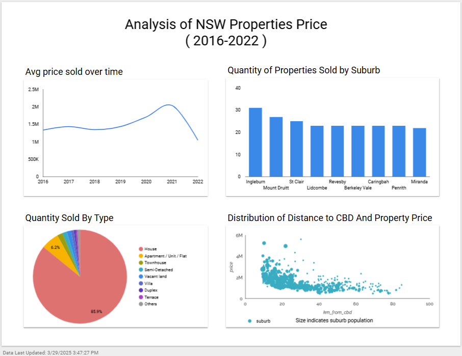

# Domain Properties Price Analysis 2016-2022
My final project submission for the 2025 Zoomcamp! This project was built using tools taught by DataTalksClub. Huge thanks to all the coaches—I’ve learned so much from scratch here.
## Problem Description
The goal of this project is to conduct an in-depth analysis of historical housing prices across New South Wales (NSW). Given the city's dynamic real estate market, this topic is highly relevant to residents, owners, investors, and policymakers. By leveraging this dataset, I aim to track housing price trends across different suburbs over time, identifying areas with significant growth potential. The interactive dashboard offers valuable insights into market fluctuations, helping users make informed investment decisions and assess potential opportunities in the evolving property landscape.

I use below dataset for this project from Kaggle: 
    https://www.kaggle.com/datasets/alexlau203/sydney-house-prices/data?select=domain_properties.csv

## Technologies

* Google Cloud Platform (GCP)
* VM instance
* Docker
* Cloud storage bucket 
* BigQuery as data warehouse
* Terraform for Infrastructure as code
* Kestra for workflow orchestration
* Batch pipeline: Spark
* Looker studio

## Step 1：Use Terraform to Create Infrastructure
### Setting up a service account on GCP
* Go to Google cloud - IAM&Admin - Create Service Account - Service Account Name: project2025 - Grant Roles for Service Account (Storage Admin, Bigquery Admin)
### Setting up Credentials and Create bucket in GCP
* Generate Json key 
* Save as mycreds.json under keys folder
* Create main.tf [(See Script)](https://github.com/Alisasu3/project-zoomcamp-2025/blob/main/Terraform/main.tf) 
* Create gitignore file (Ignore Json key) 
* Run:
    1. export GOOGLE_CREDENTIALS='/home/su/project-zoomcamp-2025/keys/mycreds.json' echo $GOOGLE_CREDENTIALS  
    2. terrraform fmt - terraform init - terraform plan - terraform apply

## Step 2: Use Kestra to Load Data to Google Cloud Platform (GCP) 
* Using: 
    1. Google Cloud Storage (GCS) as a data lake 
    2. BigQuery as a data warehouse
* Pull Kestra image from Docker Hub
* Start Kestra in Docker container (Instruction see Instruction_kestra file)
* Forward 8090 - Access Kestra at localhost: 8090
* Download Service Account Json key and Kaggle Json key - Save in Kestra KV store and setup [(01_gcp_key.yaml)](https://github.com/Alisasu3/project-zoomcamp-2025/blob/main/Kestra/01_gcp_key.yaml)
* Create schema [(02_gcp_setup_bq.yaml)](https://github.com/Alisasu3/project-zoomcamp-2025/blob/main/Kestra/02_gcp_setup_bq.yaml)
* Dowmload csv from Kaggle, create table and load to GCP [(03_gcp_loaddata.yaml)](https://github.com/Alisasu3/project-zoomcamp-2025/blob/main/Kestra/03_gcp_loaddata.yaml) 
* Use Kestra to automate workflow 

## Step 3: Batch Processing
* Install JAVA and Spark 
* Download and unzip file (Using download_sydney_data.sh)
* Data Ingestion/Workflow Orchestration 

    1. Partitioning 
    Use pyspark to read csv file – Partitions across the cluster nodes – Save data to parquet file (compress the size of csv file) – Use spark to create data frame - Use SQL function to transform columns - Spark Master UI for monitoring the process [(See 01_pyspark.ipynb)](https://github.com/Alisasu3/project-zoomcamp-2025/blob/main/Batch/code/01_pyspark.ipynb)
    2. SQL transformations 
    Querying with SQL - Read parquet files with Spark - Further process data using SQL function - Aggregate data for report - Save results in parquet [(See 02_sql_spark.ipynb)](https://github.com/Alisasu3/project-zoomcamp-2025/blob/main/Batch/code/02_sql_spark.ipynb) - Upload parquet data to Google cloud
    3. Connect with Google Cloud 
    Download google cloud connector - Connect local spark to Google Cloud Storage - Read files from GCS [(See 03_spark_gcs.ipynb)](https://github.com/Alisasu3/project-zoomcamp-2025/blob/main/Batch/code/03_spark_gcs.ipynb)
    4. Spark Cluster 
    Create a Local Spark Cluster - Copy Spark Master URL - Forward port 8081 (should see Worker Id and Application ID in Spark Master) [(See 04_sql_spark_url.ipynb)](https://github.com/Alisasu3/project-zoomcamp-2025/blob/main/Batch/code/04_sql_spark_url.ipynb) - Convert to Python script [(See 05_sql_spark_url.py)](https://github.com/Alisasu3/project-zoomcamp-2025/blob/main/Batch/code/05_sql_spark_url.py) - Execute Python
    5. Dataproc job 
    Upload processed data to Google Cloud Storage - Create a Dataproc Cluster in google cloud - Upload python script [(See 06_sql_spark_dataproc.py)](https://github.com/Alisasu3/project-zoomcamp-2025/blob/main/Batch/code/06_sql_spark_dataproc.py)  - Submit job in Google Cloud cluster
    6. Connect with BigQuery 
    Upload processed/aggregated data to BigQuery table(for upstream analysis) - Upload python script to Dataproc job[(See 07_sql_spark_big_query.py)](https://github.com/Alisasu3/project-zoomcamp-2025/blob/main/Batch/code/07_sql_spark_big_query.py) - Connect Dataproc to BigQuery - Submit job
    7. Upload more data to BigQuery 
    Upload detailed data to BigQuery table - Upload python script to Dataproc job [(See 08_sql_spark_bq_domian.py)](https://github.com/Alisasu3/project-zoomcamp-2025/blob/main/Batch/code/08_sql_spark_bq_domain.py) - Connect Dataproc to BigQuery - Submit job 

More details/notes of how I built Batch pipeline can be found in this file [Instruction_batch.md](https://github.com/Alisasu3/project-zoomcamp-2025/blob/main/Batch/code/Instruction_batch.md)
## Step 4: Dashboard
My dashboard can be accessed here [Dashboard](https://lookerstudio.google.com/s/tvuljM4rBm8) 
Here is a screenshot of my dashboard

